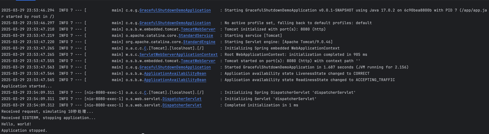
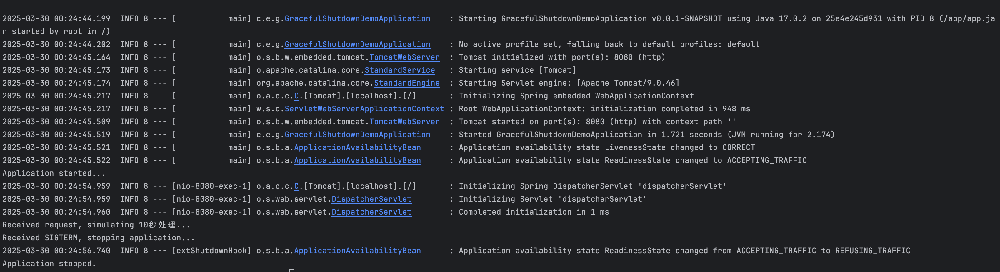

# springboot-graceful-demo
spring boot优雅下线demo

> [!TIP]
>
> 如果你将 `spring.lifecycle.timeout-per-shutdown-phase` 配置为 30 秒，那么 Kubernetes 的 `terminationGracePeriodSeconds` 可以设置为 40～60 秒，以确保在应用完成优雅关闭前 Pod 不会被强制杀死。

前提条件是在spring boot配置文件中配置 

```
server.shutdown=graceful
```

## 1、不运行运行脚本，下面两种都能优雅下线

```
ENTRYPOINT ["/usr/bin/tini", "--", "java", "-jar", "/app/app.jar"]
ENTRYPOINT ["sh", "-c", "java -jar /app/app.jar"]
```

## 2、运行脚本，脚本处理信号

```sh
#!/bin/bash

# 启动 Java 进程，并在后台运行
java -jar /app/app.jar &
app_pid=$!  # 记录 Java 进程的 PID

# 定义信号处理函数
terminate() {
  echo "Received SIGTERM, stopping application..."
  kill -TERM "$app_pid"  # 向 Java 进程发送 SIGTERM 信号
  wait "$app_pid"        # 等待 Java 进程退出
  echo "Application stopped."
  exit 0
}

# 捕获 SIGTERM 信号
trap terminate SIGTERM

# 等待 Java 进程退出
wait "$app_pid"
```

```sh
ENTRYPOINT ["/app/entrypoint.sh"]
```

```sh
# 测试
curl -X get http://localhost:8080/hello
docker kill --signal=SIGTERM <container_id>
# 验证发出SIGTERM信号后，返回hello wold进程才关闭
```

上面脚本正确管理了 `SIGTERM` 信号并转发给 Java 进程，那么 **在大多数情况下不需要 `tini`**，但 `tini` 仍然可以提供额外的僵尸进程清理能力。



server.shutdown=graceful要打开，不打开的话



